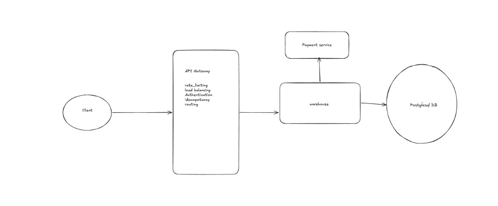

# Limited-Stock Concurrent System

## Problem

Design a **limited-stock concurrent system** where **multiple customers may try to buy from the same limited stock line concurrently**, and **stock must never go negative**.

---

## What is it?

A **limited-stock concurrent system** that allows customers to browse and purchase items from a limited inventory (e.g. gift cards, tickets, vouchers, physical products). The core challenge: **prevent overselling** when many users compete for the same popular items at peak traffic (e.g. 10K RPS). The system must guarantee **strong consistency** (stock never goes negative), **synchronous purchase flow**, **idempotency** (no duplicate purchases on retry), and **horizontal scalability** while handling regional stock and optional payment integration.

---

## Clarifying Questions (Engineers Should Ask)

### Your questions (and why they matter)

**1. Consistency**

- Should the stock never go negative?
- If two users buy the last item simultaneously, should one fail immediately?
- **Assume:** Strong consistency required — one succeeds, one fails; no overselling.

**2. Purchase flow**

- Is the purchase synchronous?
- Do we reserve stock before payment or deduct after payment?
- **Assume:** Synchronous purchase; deduct after payment (or single atomic flow).

**3. Scale**

- Expected RPS?
- Number of stock lines / items?
- **Assume:** Peak traffic 10K RPS; 100K stock lines.

**4. Business logic**

- Can users buy multiple units per request?
- Is stock global or region-specific?
- **Assume:** Users may buy multiple units; stock is regional.

---

### Other questions worth asking in an interview

- **Payment:** Do we integrate with a payment provider, or assume payment is handled externally?
- **Admin:** Do we need admin APIs to update stock, add new items?
- **History:** Do users need to view purchase history?
- **Item delivery:** Email code, in-app display, physical shipment?

---

## Requirements

### Functional Requirements

1. **Browse available items** — List items by brand, value, region.
2. **Purchase item** — User can purchase one or more units from a stock line.
3. **Prevent overselling** — Stock must never go negative.
4. **Deduct stock atomically** — Single atomic operation for stock decrement.
5. **Return purchase result synchronously** — Client receives success/failure in the same request.
6. **Optional:** Admin update stock; view purchase history.

### Non-Functional Requirements

| NFR | Target |
|-----|--------|
| **Consistency** | Stock must never go negative. |
| **Availability** | System remains available under load. |
| **Latency** | Purchase response < 200 ms. |
| **Scalability** | Handle 10K+ concurrent requests. |
| **Reliability** | Prevent duplicate purchases (idempotency). |
| **Observability** | Monitor purchase failures, stock depletion, DB contention. |

---

## Capacity Estimation

**Assumptions:**

- 10M users
- Peak 10K RPS purchase traffic
- 100K stock lines
- Purchase record size: ~500 bytes

**Storage:**

- Daily purchases: 1M/day ≈ 500 MB/day ≈ 180 GB/year
- Database storage manageable with standard scaling.

---

## Core Entities / Data Model

### StockLine

| Field | Type | Description |
|-------|------|-------------|
| `id` | VARCHAR | Primary key. |
| `brand` | VARCHAR | e.g. Tesco, Amazon. |
| `value` | VARCHAR | e.g. £10, $25. |
| `region` | VARCHAR | e.g. UK, US, EU. |
| `remaining_quantity` | INT | Available stock. |
| `created_at` | TIMESTAMP | |

**Example:** `Tesco | £10 | UK | remaining=100`

### Purchase

| Field | Type | Description |
|-------|------|-------------|
| `id` | VARCHAR | Primary key. |
| `user_id` | VARCHAR | Foreign key to User. |
| `stock_line_id` | VARCHAR | Foreign key to StockLine. |
| `quantity` | INT | Units purchased. |
| `status` | VARCHAR | `PENDING`, `SUCCESS`, `FAILED`. |
| `created_at` | TIMESTAMP | |

### User

| Field | Type | Description |
|-------|------|-------------|
| `id` | VARCHAR | Primary key. |
| `email` | VARCHAR | |
| `region` | VARCHAR | User's region for stock matching. |

---

## API Design

### Purchase API

**`POST /purchases`**

| Header / Body | Type | Required | Description |
|---------------|------|----------|-------------|
| `Idempotency-Key` | string | recommended | Prevents duplicate purchases on retry. |
| `user_id` | string | yes | User ID. |
| `stock_line_id` | string | yes | Stock line to purchase from. |
| `quantity` | int | yes | Number of units (default 1). |

**Request:**

```json
{
  "user_id": "123",
  "stock_line_id": "456",
  "quantity": 1
}
```

**Response:**

```json
{
  "purchase_id": "abc123",
  "status": "SUCCESS"
}
```

### Get Items

**`GET /items`**

Returns available items (optionally filtered by region, brand).

| Query | Type | Description |
|-------|------|-------------|
| `region` | string | Filter by region. |
| `brand` | string | Filter by brand. |
| `limit` | int | Pagination. |
| `cursor` | string | Pagination cursor. |

### Admin Stock Update

**`POST /stock/update`**

Admin-only. Updates stock for a stock line.

| Body | Type | Required | Description |
|------|------|----------|-------------|
| `stock_line_id` | string | yes | Stock line to update. |
| `quantity` | int | yes | New remaining quantity (or delta). |

---

## High-Level Architecture

*(See High-Level Architecture diagram in [Images](#images) section below.)*

**Flow:**

```
Client → API Gateway → Purchase Service (Warehouse) → PostgreSQL
                              ↓
                       Payment Service
```

### Components

| Component | Responsibility |
|-----------|----------------|
| **Client** | User or application making purchase requests. |
| **API Gateway** | Rate limiting, load balancing, authentication, idempotency, routing. |
| **Purchase Service (Warehouse)** | Core purchase logic: validate input, atomic stock decrement, create purchase record, coordinate with payment. |
| **Payment Service** | Process payment (external or internal). |
| **PostgreSQL** | Primary data store; atomic stock updates; source of truth. |

### Optional components

- **Redis Cache** — Fast stock reads; reduce DB load.
- **Event Queue (Kafka)** — Analytics logging; hot stock serialization.
- **CDN** — Static content (item catalog).
- **Analytics Pipeline** — Prometheus, Grafana, Elastic Stack.

---

## Images

The diagram below shows the high-level architecture for the limited-stock concurrent system: Client → API Gateway → Warehouse (Purchase Service) → Payment Service and PostgreSQL.



---

## Purchase Flow

1. **Client** sends purchase request to API Gateway.
2. **API Gateway** applies rate limiting, auth, idempotency check; routes to Purchase Service.
3. **Purchase Service** validates input (user exists, quantity reasonable, stock line exists).
4. **Atomic stock decrement** — Single SQL update; see [Preventing Overselling](#preventing-overselling-core-problem).
5. **Create purchase record** — Insert into `purchases` table with status `SUCCESS` or `FAILED`.
6. **Return response** — Synchronous response to client.

**Critical rule:** Stock update must be atomic. Database ensures no race conditions.

---

## Preventing Overselling (Core Problem)

Use **atomic SQL update** in PostgreSQL. The database guarantees atomicity and prevents race conditions.

### Single quantity

```sql
UPDATE stock_lines
SET remaining_quantity = remaining_quantity - 1
WHERE id = $stock_id
  AND remaining_quantity >= 1
RETURNING remaining_quantity;
```

- **If update returns a row** → purchase success.
- **If no rows updated** → stock exhausted; purchase fails.

### Multiple quantity

```sql
UPDATE stock_lines
SET remaining_quantity = remaining_quantity - $qty
WHERE id = $stock_id
  AND remaining_quantity >= $qty
RETURNING remaining_quantity;
```

**Why this works:**

- Database ensures atomicity.
- Prevents race conditions.
- Handles concurrency safely without application-level locks.

---

## Idempotency Protection

Clients may retry requests (e.g. timeout, double-click). Use **idempotency keys**.

| Header | Description |
|--------|-------------|
| `Idempotency-Key: purchase-123` | Client-generated unique key per purchase intent. |

**Server behavior:**

- Before processing, look up `(user_id, idempotency_key)`.
- If a result exists → return cached response (same purchase_id, status).
- If not → process purchase, store result, return response.
- TTL: e.g. 24 hours.

---

## Scaling Strategy

At high traffic, introduce:

### Redis cache for stock reads

**Flow:**

1. Check Redis for approximate stock (optional fast path).
2. Attempt DB update (source of truth).
3. On success, update Redis (invalidate or decrement).

**Note:** Database remains source of truth for purchase path. Cache reduces read load for browse/listing.

---

## Hot Stock Problem

Popular items cause **high contention** on a single row — many concurrent updates hit the same `stock_lines` row, leading to locks, retries, and latency spikes.

### Option 1: Partition stock

**Idea:** Split stock into multiple sub-rows so requests spread across different rows.

**Example:** Tesco £10 with 300 units → 3 rows of 100 each.

| stock_line_id | gift_card | remaining_quantity |
|---------------|-----------|---------------------|
| 1 | Tesco £10 | 100 |
| 2 | Tesco £10 | 100 |
| 3 | Tesco £10 | 100 |

**Flow:**

1. When a purchase comes in, pick one stock line **randomly** (or round-robin / consistent hashing).
2. Attempt atomic decrement on that row.
3. If success → done.
4. If row has 0 → try next partition or fail.

**Benefits:**

- Reduces DB row contention.
- Scales horizontally.
- Each row still uses atomic update → no overselling.

### Option 2: Queue-based serialization

**Idea:** Use a queue (Kafka, RabbitMQ) to serialize purchase requests per stock line.

**Flow:**

1. Client → API Gateway → Purchase Service.
2. Purchase Service validates; pushes request to queue, keyed by `stock_line_id`.
3. Worker consumes messages **one by one per stock line**.
4. Worker performs atomic DB decrement; returns result.
5. Client gets response via synchronous wait or async notification (webhook/polling).

**Benefits:**

- Zero overselling (single worker per partition).
- Handles extreme hotspots (10K+ RPS queued safely).
- Resilient (retries, DLQ).

**Trade-offs:**

- Adds latency (queue processing).
- More complex (Kafka, workers, monitoring).

### Comparison

| Feature | Partitioning | Queue-based |
|---------|--------------|-------------|
| Complexity | Low | Medium–High |
| DB contention | Reduced | Minimal |
| Throughput | High | Moderate |
| Latency | Low | Slightly higher |
| Consistency | Strong | Strong |
| Hotspot handling | Good | Excellent |

**When to choose:**

- **Partitioning:** Moderate load, low latency, simpler system.
- **Queue-based:** Extreme hotspots, can tolerate async delay, deterministic processing.

**Interview tip:** *"For most items, I'd use partitioned stock rows with atomic DB updates. For extremely popular items, I'd use a queue per stock line to serialize requests. This balances throughput, consistency, and latency."*

---

## Geo-Location Considerations

If stock is regional (UK, US, EU):

**Architecture:**

```
Global Load Balancer
        ↓
Regional Clusters (UK, US, EU)
```

**Benefits:**

- Lower latency (regional routing).
- Regional stock management.
- Compliance (data residency).

---

## Monitoring & Observability

**Metrics:**

- Purchase success rate
- Stock depletion (per stock line)
- Request latency (p50, p99)
- DB contention (lock waits, retries)

**Stack:**

- Prometheus + Grafana
- Elastic Stack (logs)

**Alerts:**

- Stock near depletion
- Purchase failure spike
- Database slow queries

---

## Analytics Logging

**Important events:**

- `purchase_created`
- `purchase_failed`
- `stock_depleted`

**Pipeline:**

```
Service → Event Stream (Kafka) → Analytics Warehouse
```

**Insights:**

- Popular items
- Regional demand
- Purchase conversion

---

## Failure Handling

| Failure | Handling |
|---------|----------|
| **DB failure** | Retry with backoff; circuit breaker. |
| **Payment failure** | Release reserved stock (if reserve-before-pay); or fail purchase atomically. |
| **Service crash** | Idempotent retry; client resends with same Idempotency-Key. |

---

## Security

- **Authentication** — Verify user before purchase.
- **Rate limiting** — Prevent bot stock draining; per-user and per-IP limits.
- **Fraud detection** — Unusual purchase patterns, velocity checks.

---

## Final System Diagram

```
Clients
   │
CDN (optional)
   │
Load Balancer
   │
API Gateway (rate limit, auth, idempotency, routing)
   │
Purchase Service
   │
Redis Cache (optional, for reads)
   │
PostgreSQL (source of truth, atomic updates)
   │
Event Stream (Kafka) → Analytics
```

---

## Wrap-Up (Strong Closing Statement)

*"The system ensures stock consistency by using atomic database updates that prevent overselling under concurrency. It scales horizontally using stateless services and caching, with optional stock partitioning or queue-based serialization for hot items. Monitoring and analytics ensure operational visibility. Regional deployment allows low latency and regulatory compliance for global users."*

---

## Why This Scores Well in Interviews

This design demonstrates:

- Concurrency handling (atomic DB operations)
- API design (REST, idempotency)
- Architecture thinking (gateway, services, DB)
- Scalability (cache, partitioning, queue)
- Monitoring and observability
- Geo considerations
- Analytics and event streaming
